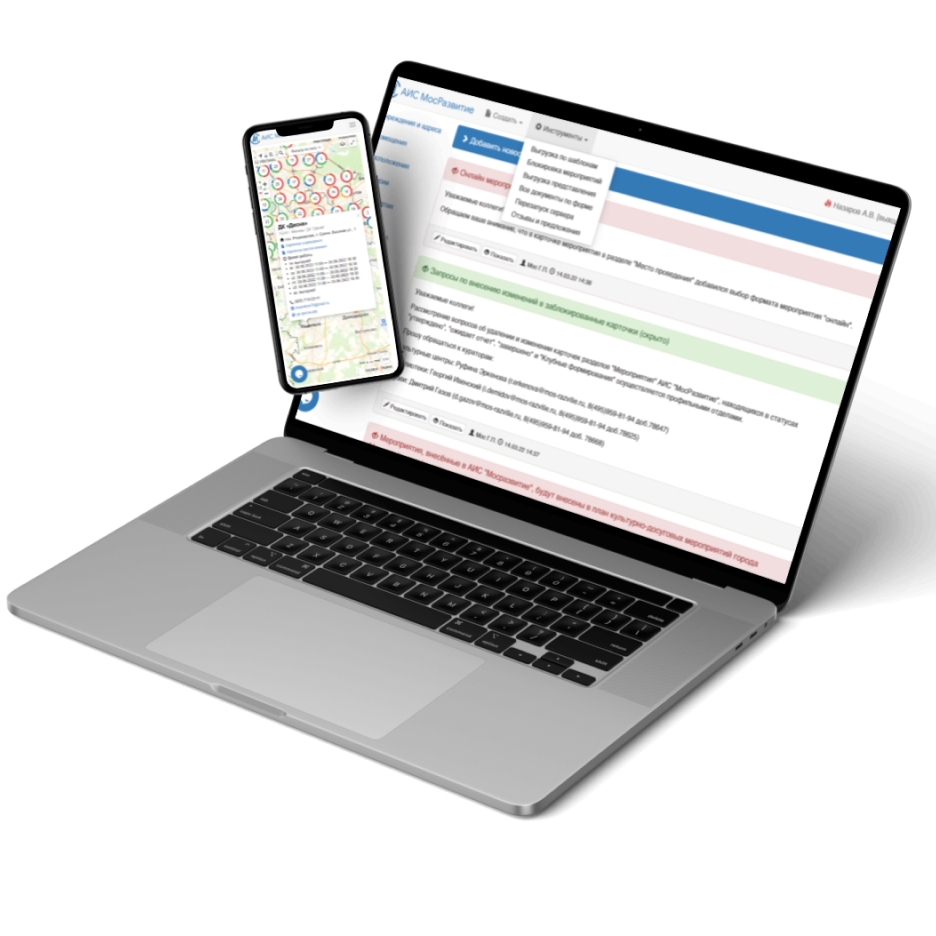
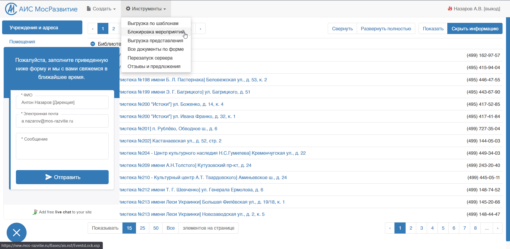
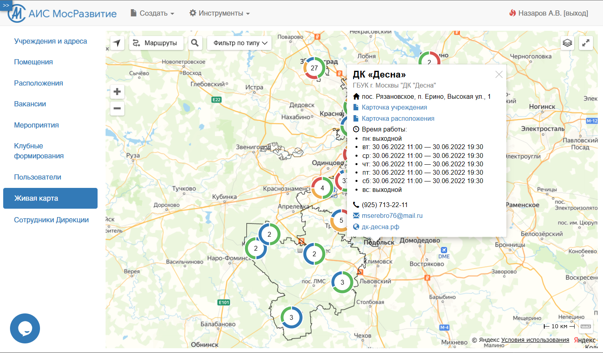

# AIS MosRazvitie - Government Cultural Operations System

## Overview

AIS MosRazvitie was an industry information system used by the Directorate of Cultural Centers of Moscow to collect, manage, moderate, analyze, and export operational data from subordinate cultural institutions.

The platform served libraries, cultural centers, and directorate staff, supporting the core reporting and analytics workflow of the organization. It was not a narrow internal tool, but a central system for managing institution data, event data, address data, questionnaires, reports, and external data exchange.

The main challenge of the project was evolving a legacy IBM Domino-based system into a more structured, scalable, secure, and visually modern platform while preserving day-to-day usability for a large number of operational users.

---

## My Role

I was involved end-to-end across both product and technical ownership.

My work included:

- stakeholder communication and requirements gathering
- documentation and system design materials
- implementation and ongoing development
- architecture decisions and form design
- analysis of the legacy IBM Domino system and its security risks
- user training and webinar-based feedback collection
- server setup, maintenance, and backup configuration
- support workflow changes and operational rollout

---

## What the System Does

- Store and manage institution, address, event, and activity records
- Support data entry by subordinate organizations and moderation by directorate staff
- Track event lifecycle and reporting status
- Generate filtered exports and formal reports
- Provide questionnaires and structured data collection forms
- Support service actions on groups of records
- Run background agents for status updates, unlocks, and cleanup
- Exchange approved data with external systems over HTTP/XML

---

## Key Features

### Multi-Entity Data Model
The system was built around multiple linked card types rather than a single registry, including institutions, addresses, events, club formations, questionnaires, and reporting templates.

---

### Reporting and Export Engine
Users could generate structured exports and reports based on templates, views, filters, and query parameters, with output prepared for tools such as Excel, Word, and PDF.

---

### Report and Form Generators
I developed generators for forms, fields, filters, and reports, which reduced manual dependence on one department and allowed multiple parallel report-generation workflows.

---

### Operational Workflows
The platform supported real administrative workflows: planning events, updating future schedules, filling post-event reports, blocking edits during critical stages, and moderating records before downstream use.

---

### Admin and Service Actions
The system included service operations for batch actions on records, as well as server agents for unlocking records, updating statuses, cleaning up outdated files, and maintaining data consistency.

---

### Security and Access Control
I designed and implemented role-based authorization, access-control policies, protected server access, and stronger transport security, helping move the system away from an unsafe legacy state with weak protection of employee and customer data.

---

### Interactive Object Map
The system also included an interactive map of institutions and objects built on the Yandex.Maps API, improving visibility and navigation across the managed network.

---

### External Data Exchange
Approved records could be published for external consumption through HTTP/XML endpoints, including change tracking and support for external parsing based on published XML schemas.

---

### Web-Based Access
The platform exposed a web interface for distributed operational use across many institutions, making centralized reporting and data quality control possible at scale.

---

## Tech Stack

- **Platform:** IBM Domino / Notes
- **Frontend / Web Layer:** XPages, JavaScript, Java, CSS, HTML, XML
- **Architecture:** Card-based data model, views, templates, forms, agents
- **Integrations:** HTTP, XML, Yandex.Maps API, digital telephony support workflows
- **Output:** Excel, Word, PDF exports
- **UI:** Web-based interface for distributed users

---

## Challenges

### Legacy Architecture Constraints
The original system was already in active use, but its early design did not account well for scale, access control, security, or clear structural separation of entities and logic.

---

### Large Operational Scope
The platform supported many organizations and a broad set of workflows, which made data modeling, permissions, lifecycle rules, and consistency much more complex than in a typical internal CRUD system.

---

### Reporting Complexity
Reporting was not a simple export button. The system needed configurable templates, filtered data sources, parameterized queries, and output structures suitable for formal reporting.

---

### Data Governance and Moderation
Information entered by institutions had to be validated, moderated, and sometimes blocked from further edits depending on operational stage and reporting requirements.

---

### Security and Scalability Improvements
One of the major drivers for the new version was the need to improve security, reduce unsafe exposure of data, introduce clearer rights separation, and support a growing volume of information and users.

---

### User Adoption and Operational Transition
The project was not only a technical rebuild. It also required training users, running webinars, collecting feedback, and reorganizing support workflows so the new system could actually be adopted in practice.

---

## Result

A central operational and reporting system that supported the daily work of the Directorate of Cultural Centers of Moscow and its subordinate institutions.

The platform enabled distributed data entry, centralized moderation, structured reporting, workflow control, and external publication of approved data, turning fragmented institutional information into a manageable system for analytics and governance.

It also improved report generation independence, strengthened security, modernized the visual layer, moved support toward real-time messaging, and made the system more maintainable and scalable than the original Domino implementation.

---

## Key Takeaway

This project demonstrates full-spectrum ownership of a large operational system: stakeholder work, architecture, implementation, documentation, user education, infrastructure responsibility, and practical rollout inside a complex real-world government context.

---

## Additional Notes

This case study is based on project documentation, resume context, and implementation notes. A deeper internal write-up can be added later if needed.

---

## Screenshots

### Cover Mockup

---

### Main Interface

---

### Interactive Map

---

### Additional Views

- [Desktop mockup](./MacBook%20Pro%2016-ais.png)
- [iPhone mockup 1](./AIS-iPhone%2012%20Pro.png)
- [iPhone mockup 2](./iPhone%2012%20Pro-ais.png)
