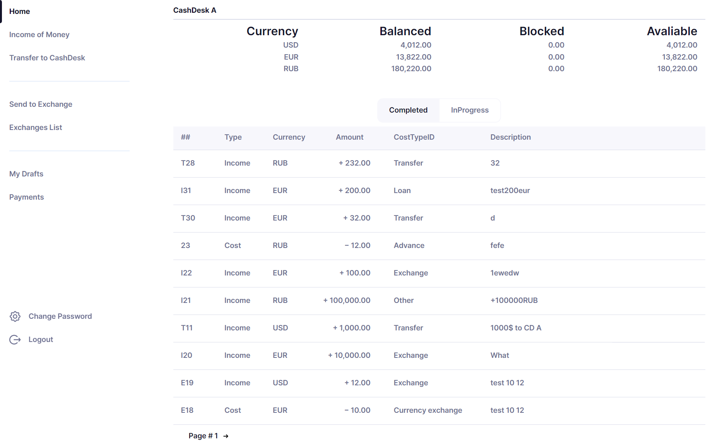
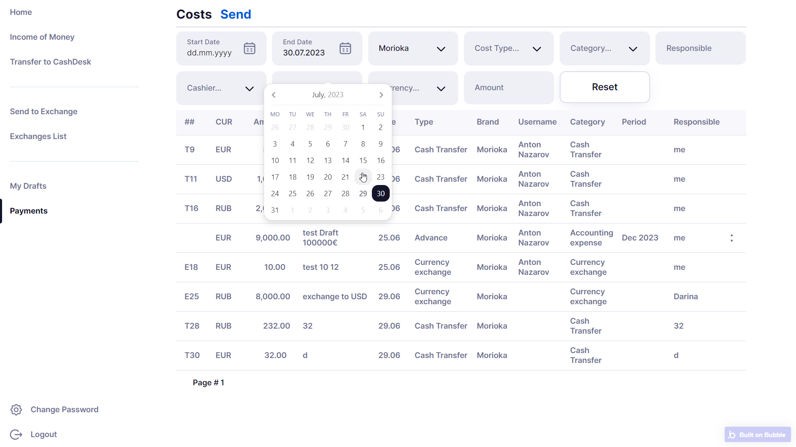
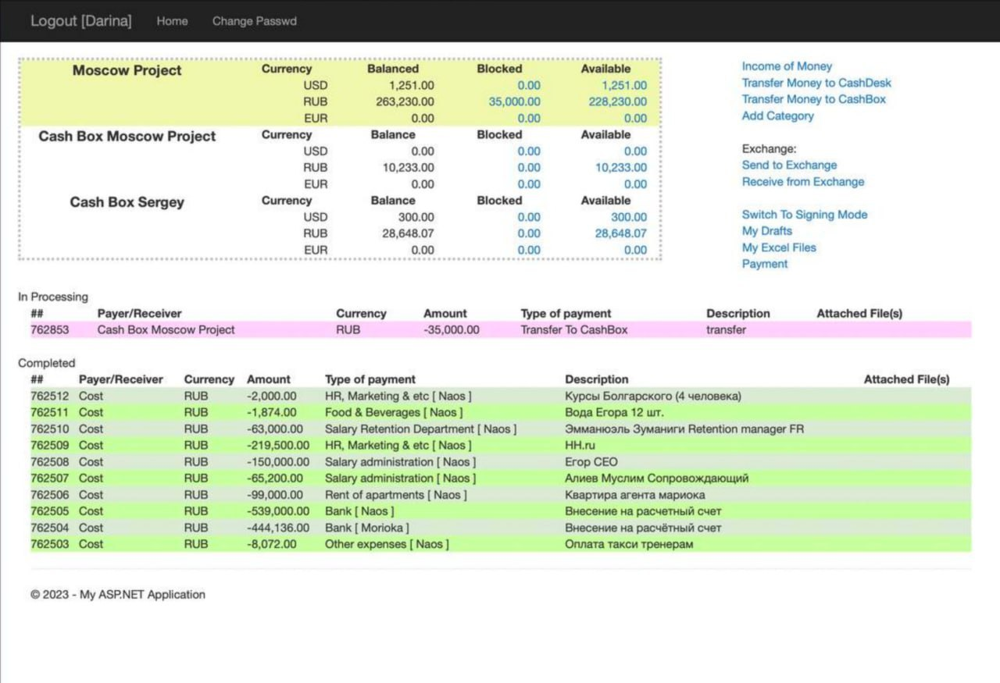

# Cashdesk Accounting - Financial Management System

## Overview

Cashdesk Accounting is an internal financial management system designed to replace and improve an inefficient legacy accounting workflow with clearer permissions, transaction handling, cashdesk operations, and export-ready reporting.

The original system was poorly designed, missing core functionality, difficult to use, and weak from a security and operational-control perspective. The project required analysis of the existing product, redesign of the experience, and pragmatic implementation on Bubble.io within the client's budget.

The result was a more usable, more secure, and more scalable internal financial tool.

---

## My Role

Developer, Designer

---

## What the System Does

- Manage user rights and access control
- Support cashdesk and transaction workflows
- Track income, costs, and currency conversions
- Produce CSV-based reports and exports
- Improve session security through auto-logout behavior
- Provide a clearer interface for financial operations and review

---

## Key Features

### Rights and Permissions
The system includes role-aware access logic with distinct roles such as Cashier, Auditor, and Admin, improving operational control and reducing risk.

---

### Cashdesk and Transaction Management
Core financial actions were reorganized into a more structured workflow, making it easier to track cash movement and operational transactions.

---

### Income, Costs, and Currency Conversion
The product supports practical day-to-day accounting actions rather than just passive record storage, including the entry of income, costs, and conversion-related operations.

---

### CSV Reporting
The system supports export-oriented reporting to help financial review, data analysis, and downstream reporting processes.

---

### Security Improvements
The implementation included auto-logout after 60 minutes of inactivity, along with stronger access-control behavior and safer session handling.

---

### UX Redesign
Rather than copying the previous system mechanically, the product was redesigned with a cleaner and more minimal interface, including sharper filters, context menus, and more understandable transaction workflows.

---

## Tech Stack

- **Platform:** Bubble.io
- **Output:** CSV exports
- **Security:** Auto-logout and access-control logic
- **Frontend Contribution:** UX/UI design and implementation

---

## Challenges

### No Clear Specification
The project required reverse-engineering and analysis of the existing system before the new one could be designed properly.

---

### Poor Legacy Baseline
The existing accounting product lacked core functionality, had weak rights management, and did not support reporting or practical cashdesk operations well.

---

### Budget Constraints
The implementation had to stay practical and efficient while still improving the system meaningfully.

---

### Financial UX Requirements
Financial tools need clarity and reliability, which made interface and flow design more important than in a generic internal CRUD product.

---

## Result

The system improved financial control, made decision-making easier, strengthened security, and created a more scalable internal accounting workflow.

It also gave the client a cleaner operational interface, support for multiple roles, better reporting, and the ability to scale the number of cashdesks, cashiers, and transactions without redesigning the whole system.

---

## Key Takeaway

This project demonstrates the ability to redesign a business-critical internal tool under ambiguity, balancing analysis, UX, security, and pragmatic delivery constraints.

---

## Additional Notes

- Upwork portfolio reference: https://www.upwork.com/freelancers/antiokh?p=1684881392436121600

---

## Screenshots

### New Main Screen

---

### Transaction View

---

### Legacy Reference System

---

### Large-Screen View

---

### Additional Images

- [Cashdesk 1](./Cashdesk%201.png)
- [Cashdesk 2](./Cashdesk%202.png)
- [Cashdesk 3](./Cashdesk%203.png)
- [Cashdesk 4](./Cashdesk%204.png)
- [Cashdesk 5](./Cashdesk%205.png)
- [Alternative iMac mockup](./iMac%2024%20inchcashdesk.png)
