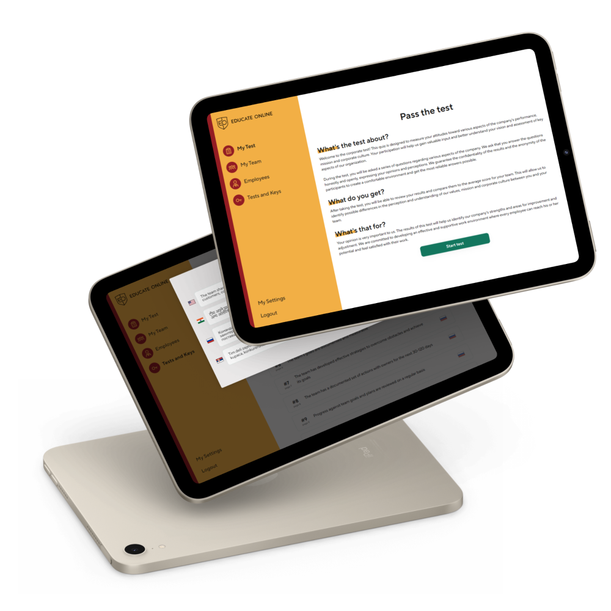
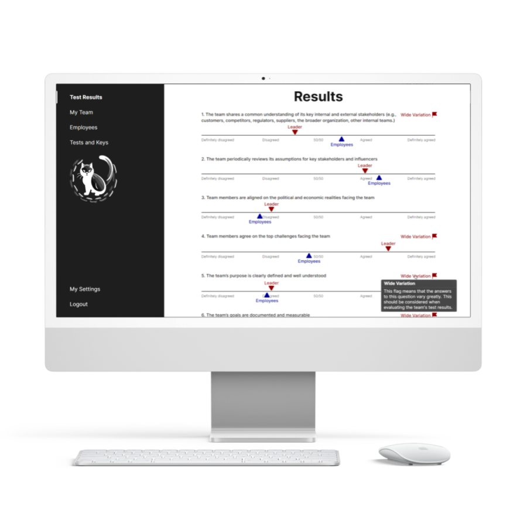
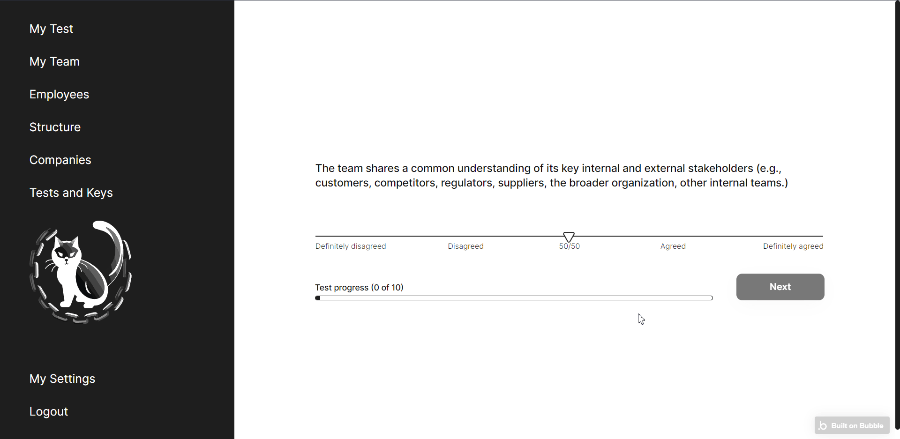
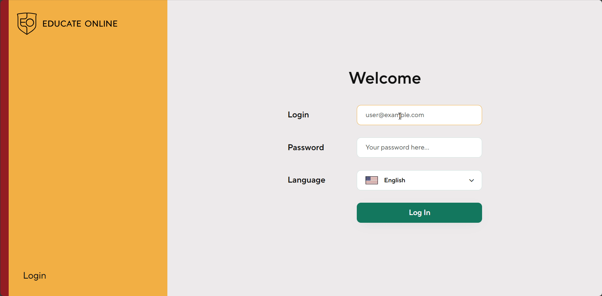
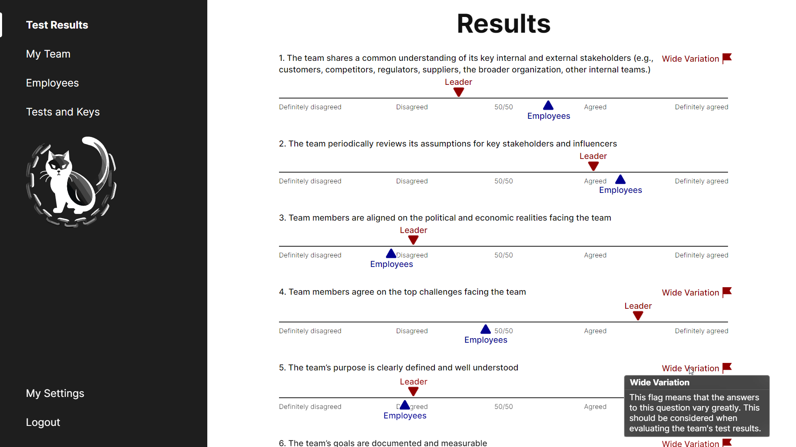
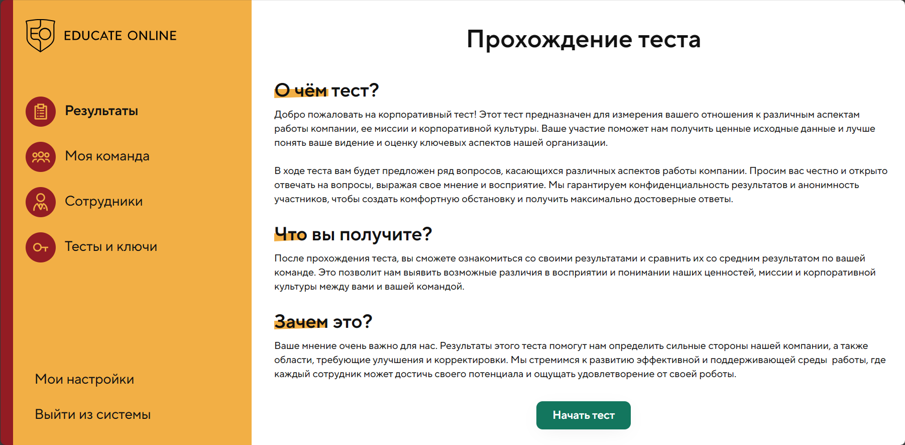
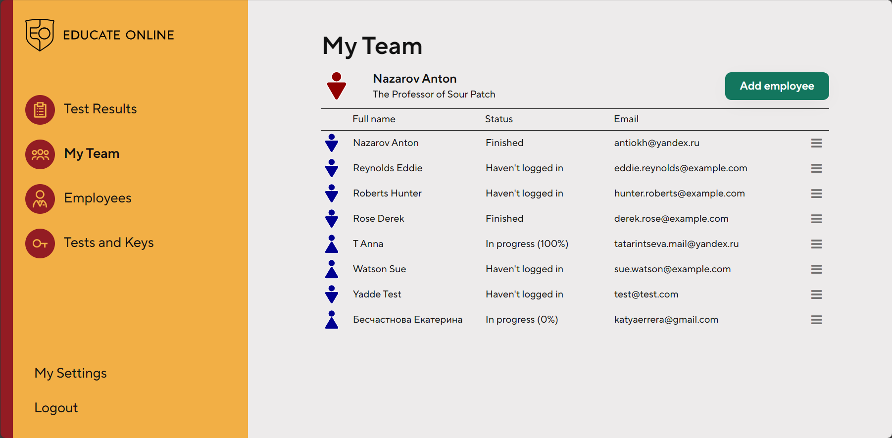
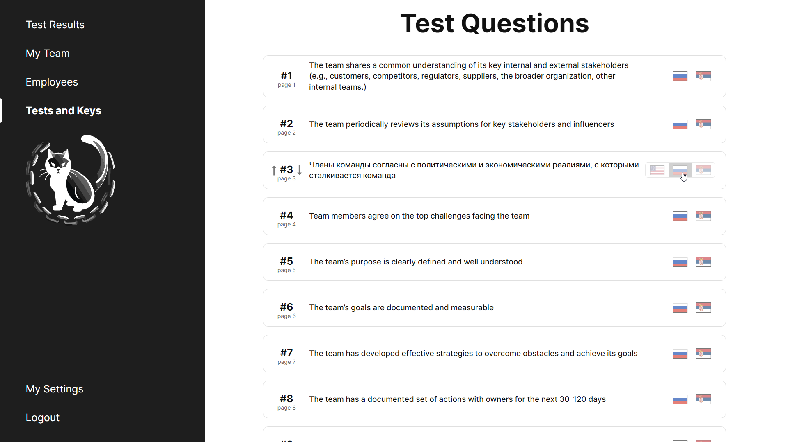

# Educate Online - Corporate Testing and Feedback System

## Overview

Educate Online is a corporate assessment system designed for large-scale employee testing, mood analysis, and opinion-gap detection inside organizations.

The product had to support multilingual use, large volumes of response data, and mathematically aggregated results while remaining usable for everyday participants and administrators. The project was completed in roughly three weeks.

The main challenge of the project was building a scalable testing and analytics workflow on top of Bubble despite platform limitations around complex calculations.

---

## My Role

Designer, Developer

---

## What the System Does

- Run structured employee tests and feedback surveys
- Support multilingual delivery for international use
- Aggregate and process large volumes of answers
- Analyze team mood and alignment
- Detect differences in perception across participants
- Present results through a visual reporting interface
- Provide a stylized test-taking flow and post-test results experience

---

## Key Features

### Multilingual Architecture
The system was designed for an effectively unlimited number of interface languages, making it suitable for international deployment.

---

### Corporate Testing Workflow
The platform supports structured employee testing and feedback collection at scale rather than one-off manual assessments.

---

### Aggregation and Analysis
A key part of the system is mathematical processing of answer sets in order to produce meaningful organizational insights from raw responses.

---

### Stylized Test Interface
Input and output of answers were implemented through stylized sliders and visual cues, helping the testing flow feel more productized than a generic form.

---

### Visual Results Layer
Results are presented through a visual output system rather than raw tabular data, improving readability for non-technical stakeholders.

---

### Branding and Differentiation
The project used a strict monochromatic visual theme with color accents to differentiate between managers and employees, creating a cleaner and more deliberate product identity.

---

## Tech Stack

- **Platform:** Bubble.io
- **Integrations:** Bing Translate API
- **Logic:** Custom external processing for complex calculations
- **UI:** Custom sliders and visual results interface
- **Skills:** API integration, UX/UI, web design, multilingual translation

---

## Challenges

### Bubble Calculation Limits
The platform did not natively support the kind of large-scale mathematical aggregation the product required, so custom external logic had to be introduced.

---

### Multilingual Complexity
Supporting many languages affected both content management and system architecture, especially when paired with dynamic survey and result logic.

---

### UX for Testing and Results
The product needed to make both answer input and result interpretation clear, which required more than standard form design.

---

### Fast Delivery Under Constraint
The system had to solve meaningful product and analytics problems while still being delivered in a short time frame.

---

## Result

A fully scalable corporate testing and feedback system launched in roughly three weeks and prepared for international use.

The product replaced a potentially fragmented internal process with a structured assessment workflow that could support many users and many languages without changing the underlying system model.

As an additional bonus for the client, integration with the Bing Translate API provided automatic baseline translations for newly added languages.

---

## Key Takeaway

This project demonstrates fast delivery of a business-critical internal system under platform constraints, combining low-code speed with custom logic, multilingual scalability, and deliberate interface design.

---

## Additional Notes

- Public app reference: https://teamassessment.educate-online.in/
- Upwork portfolio reference: https://www.upwork.com/freelancers/antiokh?p=1684878907346489344

---

## Screenshots

### Cover

---

### Main Interface

---

### Passing the Test

---

### Test Flow

---

### Results View

---

### Onboarding Flow

---

### Team Interface

---

### Admin Interface

---

### Additional Images

- [Passing the test - variant](./media/interface_passing_the_test2.png)
- [Educate Online 1 cover](./media/Educate%20Online%201cover.png)
- [Educate Online 1](./media/Educate%20Online%201.png)
- [Educate Online 2](./media/Educate%20Online%202.png)
- [Educate Online 3](./media/Educate%20Online%203.png)
- [Educate Online 4](./media/Educate%20Online%204.png)
- [Educate Online 5](./media/Educate%20Online%205.png)
- [Educate Online 6](./media/Educate%20Online%206.png)
- [Educate Online mockup](./media/Educate%20Online%20Mockup.png)
- [iMac mockup 1](./media/educate-online-imac-alt-1.png)
- [iMac mockup 2](./media/educate-online-imac-alt-2.png)
- [iMac mockup 3](./media/educate-online-imac-alt-3.png)
- [iPad mockup - current](./media/educate-online-ipad-current.png)
- [iPad mockup - old interface](./media/educate-online-ipad-old.png)
