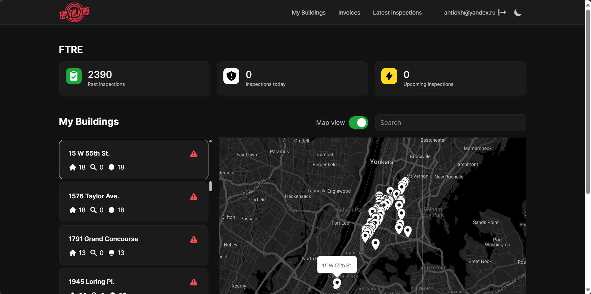
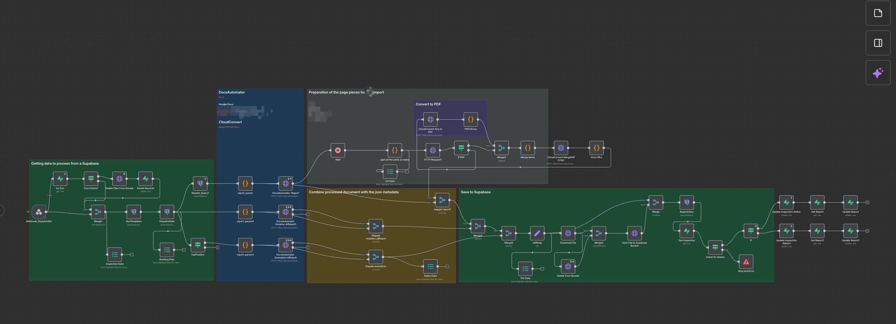

# Exit Lead - Field Inspection and Reporting Platform

## Overview

Exit Lead was a field-operations and client-reporting platform for lead inspection work, built as a dual-interface system on top of a shared Supabase backend.

The product was split into two connected applications. The internal operations side was built in Glide for inspectors, dispatchers, and admins. The client-facing side was built in WeWeb for building maps, property lists, apartment-level reports, and service requests. Together, these interfaces supported the full inspection workflow from scheduling to report delivery.

I worked on the project as a contractor for a US agency and was responsible for the builder-architect-designer role across the product.

---

## What the System Does

- Plan and assign inspector shifts and daily routes
- Show inspectors their daily jobs in a mobile-friendly interface
- Let inspectors upload photos and complete digital inspection forms on site
- Attach measurement data from lead and mold inspection devices
- Generate branded PDF reports with company signature blocks
- Deliver reports automatically to clients
- Let clients browse buildings, apartments, and reports through a web portal
- Support future invoicing and operational back-office workflows

---

## Key Features

### Dual Frontend Architecture
The product used two separate frontend systems for different user groups: Glide for internal field and operations staff, and WeWeb for client-facing reporting and property access.

---

### Inspector Workflow
Inspectors could open the app, see the plan for the day, travel to the site, upload photos, complete digital questionnaires, and trigger report generation after the visit.

---

### Dispatcher and Admin Operations
Dispatchers and admins managed shifts, schedules, uploaded files, report data, and measurement imports tied to inspections.

---

### Client Portal
Clients, typically owners of multiple buildings or property-management companies, could access maps of buildings, lists of properties, apartment-level reports, and request-related information.

---

### Automated Report Pipeline
Report generation and delivery were automated through DocsAutomator and n8n, producing PDF reports from field data and sending them to clients with company-branded output.

---

### Device Data Integration
Measurement data from inspection guns for lead and mold detection was imported through n8n and linked to dispatches, apartments, and reports.

---

## Tech Stack

- **Internal App:** Glide
- **Client Portal:** WeWeb
- **Backend:** Supabase
- **Automation:** n8n
- **Document Generation:** DocsAutomator
- **Data Processing:** OpenAI-assisted parsing during migration workflows

---

## Challenges

### Multi-Role System on a Shared Backend
The project had to support inspectors, dispatchers, admins, and clients through different interfaces while keeping all operational data in sync through Supabase.

---

### Automated Document Workflow
The core business output was the generated PDF report, so the system had to reliably transform field data, uploads, signatures, and measurement results into deliverable documents.

---

### Device Data Linking
Inspection-gun data had to be imported and matched correctly to specific dispatches, apartments, inspectors, and report records, which added real operational complexity.

---

### Large-Scale Document Migration
One of the hardest technical tasks was migrating roughly 70,000 completed reports from Google Drive into Supabase. This also required parsing resident contact data, for which OpenAI was used as part of the migration workflow.

---

### Moving Requirements
The project evolved under changing product direction and repeated experimentation, which made architecture and delivery discipline more important than usual.

---

## Result

A working inspection operations platform with mobile field workflow, client-facing property access, automated PDF reporting, and device-data integration on a shared backend.

Even though some adjacent business features such as invoicing were not fully completed, the core inspection-to-report pipeline was implemented as a structured digital system rather than a manual or document-driven process.

---

## Key Takeaway

This project demonstrates the ability to design and build a multi-surface operational platform: field app, admin workflow, client portal, automation layer, and document pipeline, all connected through a single backend and shaped around real inspection operations.

---

## Additional Notes

- Demo video: https://www.youtube.com/watch?v=3sFy9YI7p20
- Local demo file: [Desktop5-22-202411-26-24PM-ezgif.com-gif-maker.webm](./media/Desktop5-22-202411-26-24PM-ezgif.com-gif-maker.webm)

---

## Screenshots

### Client Portal

---

### Internal Interface

---

### Automation

---

### Additional Client Views

- [Client interface - objects](./media/client_interface_dark_objects.png)
- [Client interface - apartments](./media/client_interface_dark_apts.png)
- [Client interface - inspections](./media/client_interface_dark_inspections.png)
- [Client interface - light theme](./media/client_interface_light.png)
- [Client interface - desktop mockup](./media/ExitLead%20MacBook%20Pro%2016.png)
