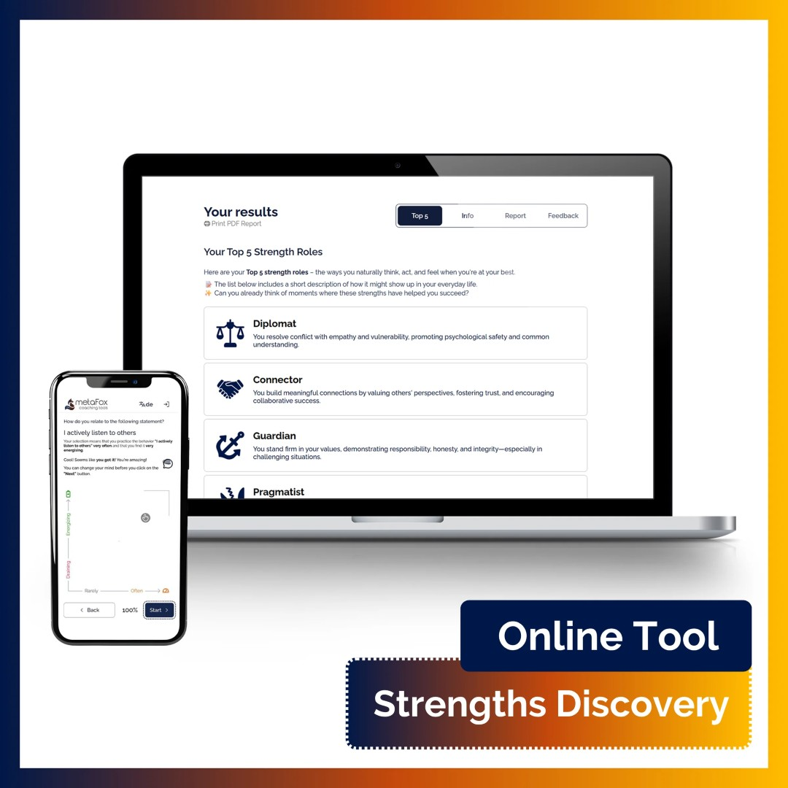
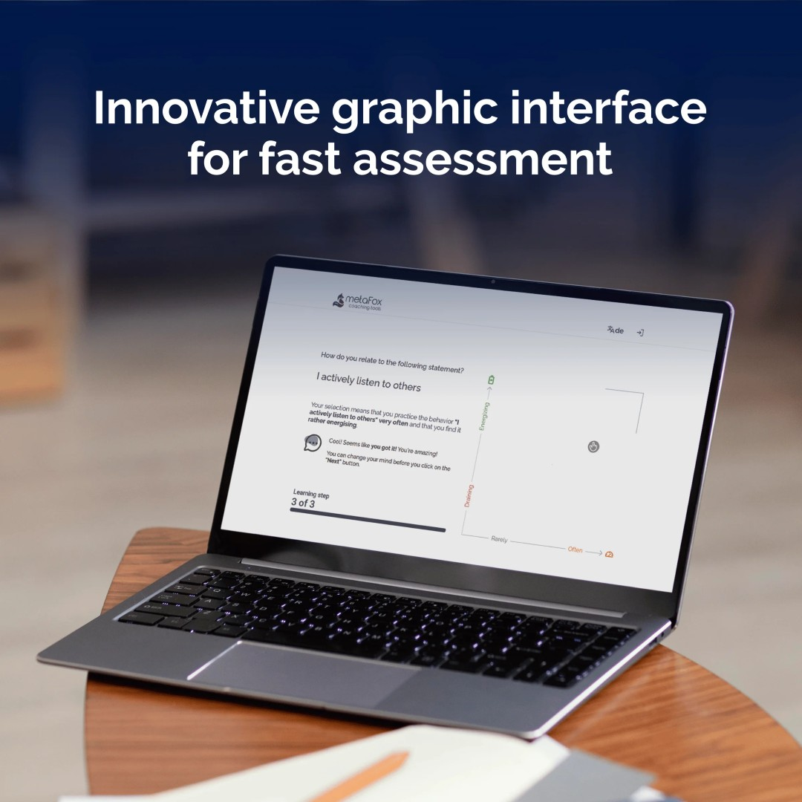
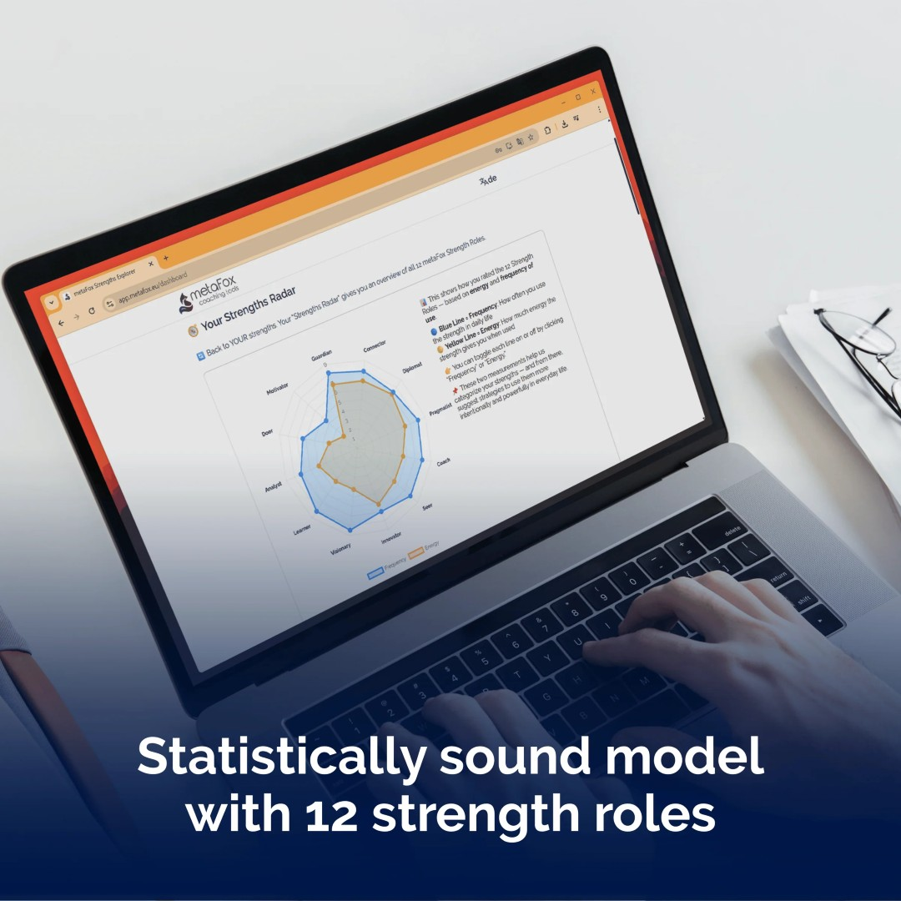

# MetaFox Strengths Explorer - Strengths Assessment Platform

## Overview

MetaFox Strengths Explorer is a browser-based strengths assessment platform for coaching and personal development.

The product combines self-assessment, peer feedback, deterministic scoring logic, and generated PDF reports to help users understand their strengths profile, underused areas, and external perception.

The core challenge of the project was translating an evolving psychometric methodology into a structured digital product that remained usable, explainable, and operationally stable.

---

## My Role

Full product owner and builder from idea to release: concept, product management, architecture, design, implementation, testing, customer communication, feedback handling, and release.

---

## What the System Does

- Run structured self-assessment sessions
- Collect peer feedback from friends, colleagues, and other respondents
- Calculate and normalize results to reduce self-report bias
- Classify strengths, under-realized areas, and weaker zones
- Generate visual results reports with radar-based presentation
- Export reports as PDF and deliver them to users
- Provide admin tools for reviewing answers, sessions, and scoring behavior

---

## Key Features

### Self-Assessment Flow
Users complete a structured questionnaire and receive a calculated strengths profile based on deterministic logic rather than AI output.

---

### Peer Feedback
Users can invite other people to evaluate them, allowing comparison between self-perception and outside perception.

---

### Scoring & Normalization
The platform does not rely on raw answers alone. It applies normalization and ranking logic to make results more interpretable and reduce distortion from overly optimistic or overly negative answer patterns.

---

### Strength Classification
The system determines realized strengths, underused strengths, and weaker areas while handling edge cases such as overly compressed or overly positive profiles.

---

### Visual Reporting & PDF Export
Results are presented visually and converted into downloadable PDF reports that can also be delivered by email.

---

### Admin & Model Inspection
Administrators can inspect sessions, answers, and final outputs to validate calculations and support future model refinements.

---

## Tech Stack

- **Frontend:** WeWeb
- **Backend:** Xano
- **Analytics:** Google Analytics
- **Output:** PDF generation, storage, and email delivery

---

## Challenges

### Evolving Assessment Model
The questionnaire and scoring model changed during implementation, including a shift from 36 to 64 questions and additional feedback dimensions. The architecture had to stay flexible without breaking the product.

---

### Biased Self-Reported Data
Raw answers were not reliable enough on their own, so the system needed normalization logic to produce psychologically credible outputs.

---

### Complex Product Logic
This was not a basic form app. The system required multi-stage calculations, rankings, classification rules, and edge-case handling across multiple data entities.

---

### Advanced Frontend Interaction
One of the hardest UI problems was building a two-dimensional input model for energy versus usage inside a no-code frontend environment.

---

### Browser-to-PDF Consistency
Charts and results screens had to remain visually stable both in-browser and inside exported PDF reports.

---

## Result

A working strengths assessment product that turns a coaching methodology into a scalable digital workflow.

The platform supports assessment, peer feedback, result interpretation, report generation, and internal model inspection in one system, while remaining adaptable as the methodology evolves.

---

## Key Takeaway

This project demonstrates the ability to turn a conceptual assessment model into a production-ready product, combining product thinking, backend architecture, deterministic scoring logic, difficult UX implementation, and polished report delivery.

---

## Additional Notes

Detailed internal case study: [metafox_strengths_explorer_case_study.md](./metafox_strengths_explorer_case_study.md)

Public product reference: https://metafox.eu/en-us/products/strengths-explorer-app-online-assessment-for-strengths-coaching

Upwork portfolio reference: https://www.upwork.com/freelancers/antiokh?p=1980790662367457280

Demo video: https://www.youtube.com/watch?v=Sz4BfwE8WTE

Sample generated report: [Anton Nazarov MetaFox Strengths Explorer 2026 PDF](../../sources/anton_nazarov_metafox_strengths_explorer_2026.pdf)

---

## Screenshots

### Main Interface

---

### Assessment Flow

---

### Results View

---

### Report Example

