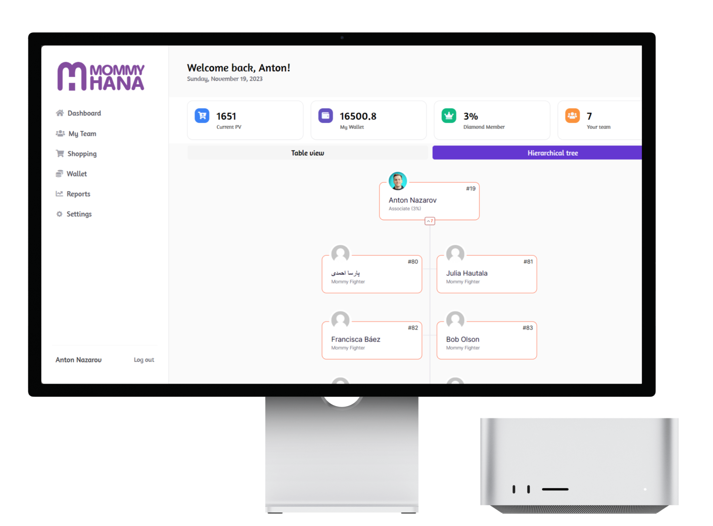
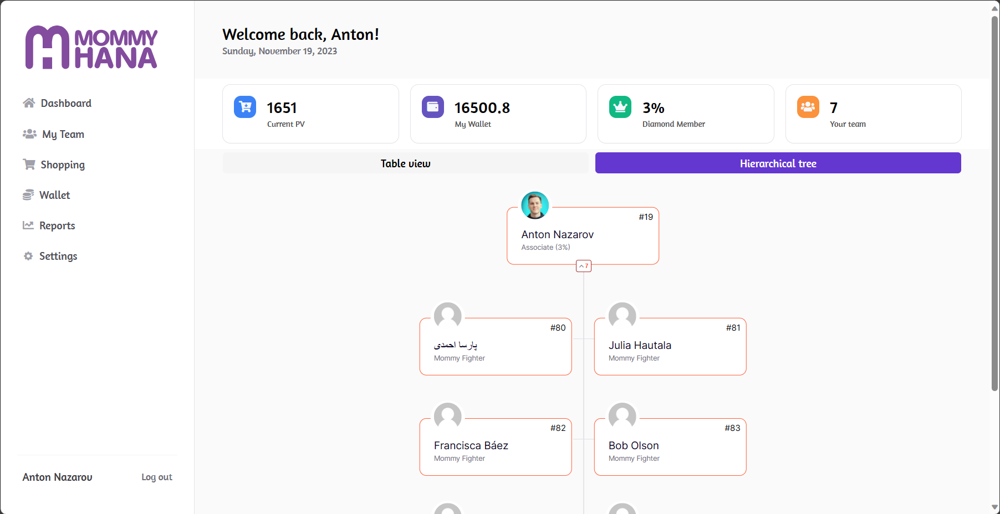
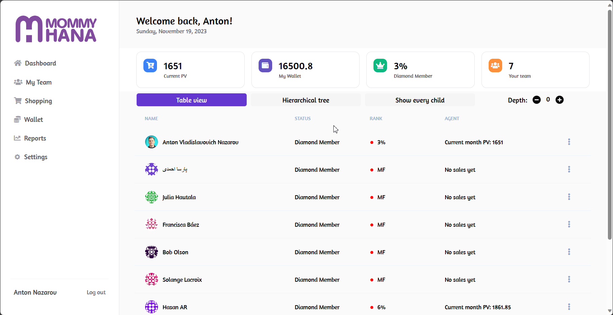

# MommyHana MBO - Agent Sales and Bonus Management System

## Overview

MommyHana MBO is a web-based internal system for managing sales, agent performance, and commission/bonus calculations inside a company.

The platform was built to work with WooCommerce in order to streamline order processing and provide real-time visibility into sales activity and agent rewards. The most technically demanding part of the product was the bonus system: it included 10 different bonus types with recursive dependencies, where some bonus values depended on other bonus values in real time.

This made the project more than a standard admin panel. It was a commission-and-bonus engine with e-commerce integration and heavy calculation logic.

---

## What the System Does

- Manage sales data for agents
- Calculate commissions and bonuses in real time
- Integrate WooCommerce order activity into the internal system
- Track agent performance and reward logic
- Provide dashboard-style access to sales and bonus information
- Support future frontend expansion on top of a working backend logic layer

---

## Key Features

### Recursive Bonus Engine
The core complexity of the project was a bonus system with 10 bonus types that depended on one another, requiring recursive real-time calculations rather than simple flat formulas.

---

### PostgreSQL-Native Calculation Logic
The recursive bonus model was implemented using native PostgreSQL views and functions, pushing the heavy business logic into the database layer for more reliable processing.

---

### WooCommerce Integration
Orders were integrated from WooCommerce into Supabase through webhooks, allowing sales transactions to be processed centrally instead of living only inside WordPress.

---

### User Provisioning Flow
The frontend used a Supabase function to create WooCommerce users and store the connection data needed for future synchronization and workflow continuity.

---

### Real-Time Sales Insight
The system was designed to give the company a clearer picture of performance, commission logic, and bonus outcomes without relying on manual spreadsheets or fragmented reporting.

---

## Tech Stack

- **Frontend:** WeWeb
- **Backend:** Supabase
- **Database Logic:** PostgreSQL views and functions
- **Integrations:** WooCommerce, WordPress, API/webhooks
- **Skills Involved:** API integration, frontend development, UX/UI, SQL, responsive web application design

---

## Challenges

### Recursive Real-Time Calculations
Most internal sales tools use straightforward formulas. This project required bonus types that referenced each other dynamically, which made the calculation model significantly harder.

---

### E-Commerce to Internal-System Sync
WooCommerce transactions had to be pushed into Supabase and processed cleanly so the internal system could work as the single source of truth for bonuses and sales calculations.

---

### Hybrid Product State
The backend and logic layers were strong enough to support the system, but the project paused while frontend requirements were being finalized, which meant the product sat in a partially completed state.

---

## Result

A working internal sales-and-bonus management backend with WooCommerce integration, real-time transaction processing, and advanced recursive bonus calculation logic.

Even though the project was later paused to finalize frontend requirements, the system demonstrates strong business-logic design and implementation in a real-world commercial workflow.

---

## Key Takeaway

This case demonstrates the ability to build non-trivial business logic systems where the real complexity lives in data modeling, recursive calculations, and operational integration rather than just in surface-level UI.

---

## Additional Notes

- Public app reference: https://mbo.mommyhana.com/
- Upwork portfolio reference: https://www.upwork.com/freelancers/antiokh?p=1767675498966056960
- Project state: paused while frontend technical requirements were being finalized

---

## Screenshots

### Main Mockup

---

### Dashboard

---

### Interface Demo

---

### Video Demo

- [Demo video](./demo.webm)
