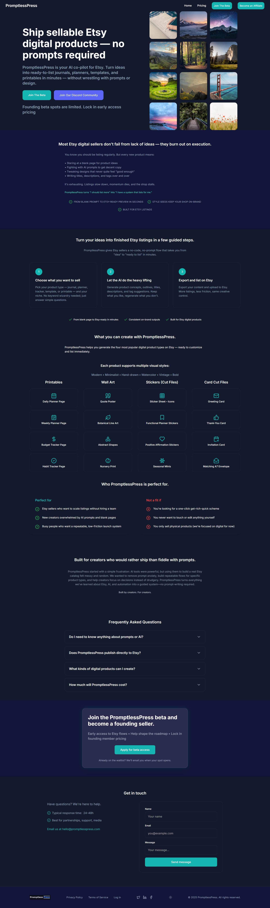
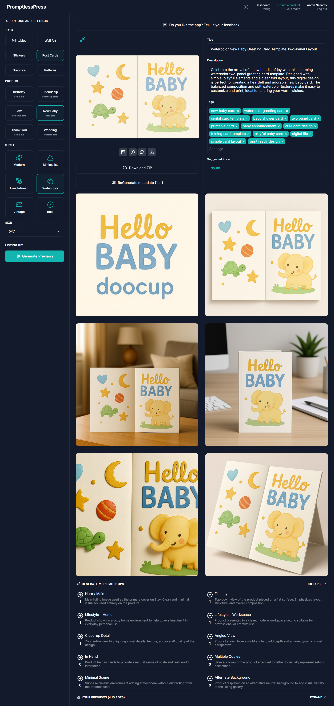

# PromptlessPress — AI Product Generation Platform

## Overview

PromptlessPress is a platform for generating ready-to-sell digital products using AI (e.g. printable cards, wall art, planners).

The system allows users to configure product parameters, generate visuals, create mockups, and export complete product packages.

The main challenge of the project was building a system that works reliably with **non-deterministic AI outputs** while keeping the user experience structured and usable.

---

## My Role

Builder, Architect, AI Workflow Designer

---

## What the System Does

- Generate product visuals based on structured inputs  
- Produce multiple previews and variations  
- Create realistic mockups (lifestyle, flat lay, etc.)  
- Generate product metadata (titles, descriptions, tags)  
- Export ready-to-sell product bundles  
- Support iterative generation rather than one-shot prompting  

---

## Key Features

### Flexible Product Configuration
Users can define:
- product type  
- style  
- format and size  
- custom input parameters  

---

### AI-Powered Generation
- automated image generation  
- multiple preview variations  
- regeneration and refinement workflow  
- fal.ai-backed execution pipeline with structured settings rather than ad-hoc prompting  

---

### Structured Prompt Composition
- SQL-driven prompt composition and generation snapshots  
- clear separation between intent, execution, assets, and mockups  
- reproducible configuration stored as generation state  
- generation settings persisted as a decision snapshot for reproducibility and downstream execution  

---

### AI Agent Guardrails
- repository-level instructions for AI agents working in VS Code / Codex  
- explicit architecture boundaries between database, edge functions, and frontend  
- task contracts and documentation rules to keep AI-assisted changes consistent  

---

### Edge Helper Layer and SQL Discipline
- shared helper layer for Supabase Edge Functions covering env access, auth, CORS, internal calls, and debugging  
- one-way database-to-git synchronization for canonical PostgreSQL definitions  
- explicit workflow for pushing SQL function definitions back into the repository for version visibility and review  

---

### Mockups & Packaging
- automatic mockup generation  
- multiple presentation formats  
- export as ready-to-use product bundles  

---

### Dashboard & Workflow
- history of generated products  
- quick access to previews and assets  
- ability to regenerate or refine outputs  

---

### Debug & Iteration Tools
- internal interface for reviewing failed or rejected generations  
- ability to inspect and refine generation inputs  
- debug UI that can automatically prefill image-debug prompts from generation context  
- designed to support continuous improvement of results  

---

## Tech Stack

- **Frontend:** WeWeb  
- **Backend:** Supabase (Postgres, Auth, Storage, Edge Functions)  
- **AI:** OpenAI, fal.ai  
- **Payments:** Stripe  
- **Development Pattern:** AI-assisted / agentic workflow with repository-specific instructions and guardrails  

---

## Challenges

### AI Output Variability
AI results are not deterministic, which required building a system that supports iteration and refinement instead of relying on one-shot generation.

---

### Prompt Iteration
A significant part of the work involved refining inputs to achieve consistent visual quality. This process is experimental and cannot be fully automated.

---

### Architecture Discipline Around AI
To keep the system stable, AI generation logic had to be constrained by explicit architecture rules, documented data flow, and controlled extension points rather than informal prompt hacking.

---

### SQL and Execution Auditability
Because generation logic spans SQL, Edge Functions, and AI execution, the system was structured to keep canonical PostgreSQL definitions auditable in git rather than letting critical logic drift only inside the database.

---

### Realtime UX Limitations
Handling asynchronous generation and keeping the UI in sync with backend state required additional workarounds.

---

## Result

A working platform that combines AI generation, product preparation, and export into a single workflow.

The system is designed to scale and evolve, while acknowledging that final output quality depends on iterative refinement rather than strict automation.

---

## Key Takeaway

This project demonstrates how to build a structured product system on top of probabilistic AI, balancing automation with human-driven refinement while also using AI-native engineering workflows to speed up implementation safely.

---

## Additional Notes

Internal AI/agent workflow reference: `D:\Git\supabase-promptlesspress`

---

## Screenshots

### Landing Page

---

### Generation Workflow

---

### Additional Images

- [Landing page](./media/landing.png)
- [Generation workflow - full page 1](./media/fullpage_generation_mockups_1.png)
- [Generation workflow - full page 2](./media/fullpage_generation_mockups_2.png)
- [Planner example](./media/planner_example.webp)
- [Planner mockup 1](./media/planner_mockup_1.png)
- [Planner mockup 2](./media/planner_mockup_2.png)
- [Planner mockup 3](./media/planner_mockup_3.png)
- [Postcard example](./media/postcard_example.png)
