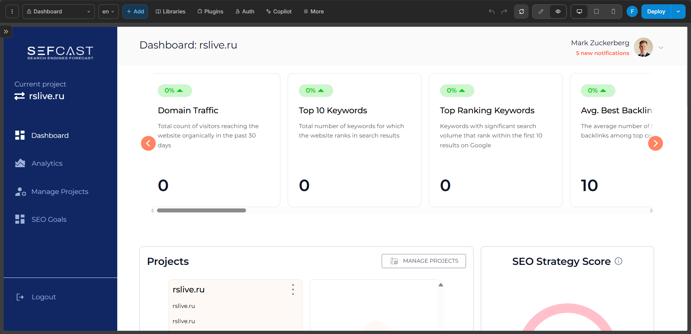
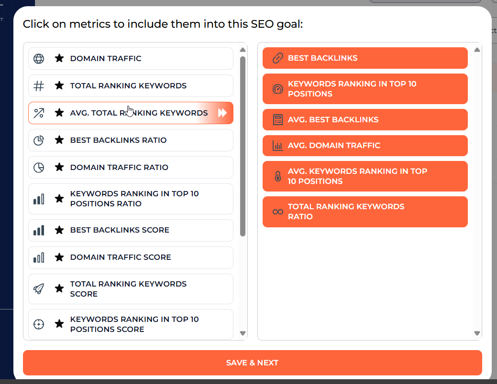
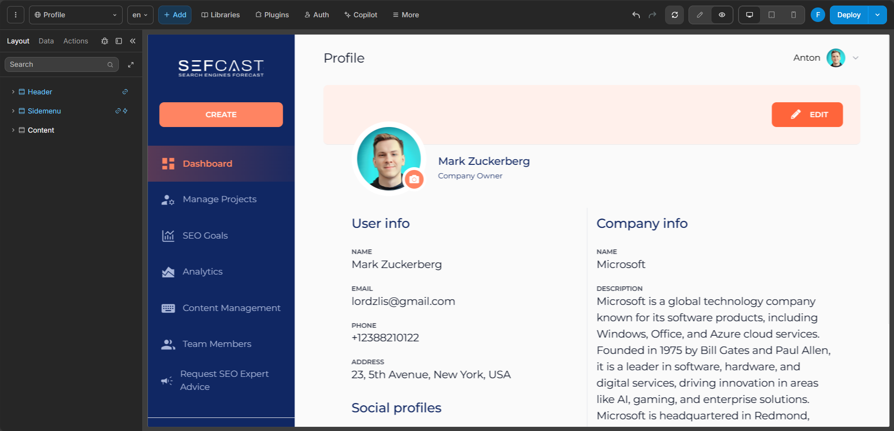

# Sefcast - AI-Assisted SEO Analytics Platform

## Overview

Sefcast is an SEO analytics product with AI-oriented positioning, built around project dashboards, SEO goal setup, analytics views, and team-facing account workflows.

From the interface structure, the product was designed as a multi-screen SaaS platform rather than a one-page dashboard. It included project navigation, SEO metrics, strategy scoring, project management, and a dedicated goal-building workflow.

My role in the project was on the frontend side: building custom components and developing the UI Kit used across the product.

---

## What the System Does

- Present SEO dashboard metrics for tracked projects
- Support project and profile management
- Organize analytics views for SEO-related performance indicators
- Let users configure SEO goals from selectable metric sets
- Provide a structured SaaS-style workspace for SEO strategy work

---

## Key Features

### Dashboard Workspace
The product includes a full dashboard layer with project-specific metrics such as domain traffic, top keywords, ranking indicators, backlinks, and strategy scoring.

---

### SEO Goal Builder
One of the core workflows is goal construction through selectable metrics, allowing users to compose custom SEO targets from multiple indicators.

---

### Multi-Screen SaaS Navigation
The interface is organized around dashboard, analytics, project management, SEO goals, content-related areas, team/member management, and profile/account screens.

---

### Reusable UI System
My contribution focused on custom frontend components and a reusable UI Kit, which helped keep the product visually and behaviorally consistent across screens.

---

### Productized Frontend Layer
The interface was clearly intended to work as a full application shell rather than a set of isolated pages, which increases the importance of coherent component design.

---

## Tech Stack

- **Frontend:** WeWeb
- **Backend:** Xano
- **My Role:** Frontend development only
- **Core Contribution:** Custom components and UI Kit
- **Product Type:** SEO analytics SaaS / AI-assisted product

---

## Challenges

### Consistency Across Product Surfaces
A product with multiple dashboards, forms, builders, and account screens needs a stable UI system rather than page-by-page styling.

---

### Custom Interactive Components
The SEO goal workflow and dashboard views required components beyond generic static layout blocks, especially for metric selection and structured workspace behavior.

---

### Product Feel
For SaaS analytics tools, interface quality strongly affects perceived product maturity, so reusable component quality matters as much as visual polish.

---

## Result

A structured frontend layer for an SEO analytics platform, with custom components and a reusable UI Kit supporting the main product workflows.

The project demonstrates frontend work at the product-system level rather than isolated page implementation.

---

## Key Takeaway

This case shows the ability to contribute to a SaaS frontend through system-level UI work: reusable components, visual consistency, and support for more complex product interactions such as dashboards and goal-building workflows.

---

## Screenshots

### Dashboard View

---

### SEO Goal Builder

---

### Profile / Account View

