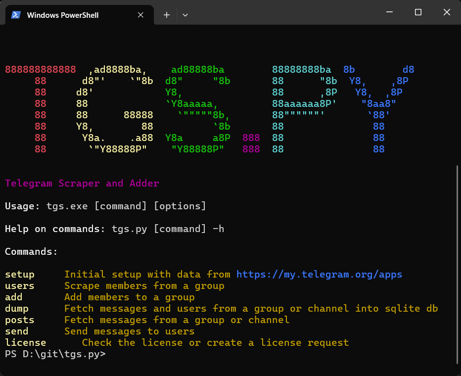
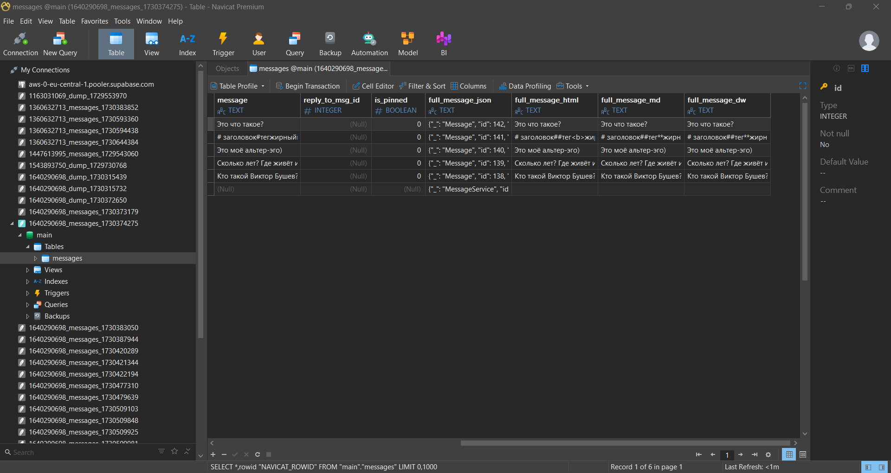
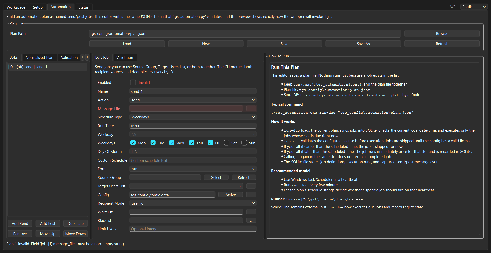

# tgs.py - Telegram Growth and Export Toolkit

## Overview

tgs.py is a Python-based Telegram operations toolkit built around Telethon, with a CLI-first architecture and an evolving desktop GUI layer.

The project supports practical Telegram workflows such as member export, user adding, bulk direct messaging, one-shot posting, message export, full chat dumps, automation planning, and local license management. Over time, the codebase also evolved beyond a single script into a more modular architecture designed to support CLI, GUI, and future automation runners from a shared core.

This makes the project more than a simple Telegram utility script. It is an operational tooling product with packaging, licensing, export pipelines, and multi-surface execution paths.

---

## My Role

Developer

---

## What the System Does

- Configure and authorize Telegram accounts through Telethon
- Export members from groups and channels into CSV
- Add users to target groups from CSV or source chats
- Send bulk direct messages using templates and recipient filters
- Post formatted messages to groups and channels
- Export posts and messages into txt, json, csv, and sqlite
- Build full channel/group dumps with messages, users, metadata, and media
- Validate local licenses and generate encrypted license requests
- Provide an early desktop GUI for status, preview, and automation-plan workflows

---

## Key Features

### Multi-Workflow Telegram Toolkit
The project combines acquisition, communication, posting, export, and data-dump workflows in one operational tool rather than splitting them into unrelated scripts.

---

### CLI-First Product Architecture
The main entrypoint is a full CLI, but the repository also includes a structured refactor toward shared core modules that can support GUI and automation entrypoints without duplicating logic.

---

### Export and Data Preservation
The toolkit can export Telegram group data, including users, messages, images, and videos, into txt, json, csv, and SQLite outputs, including richer SQLite dumps with metadata and optional media handling.

---

### Automation Layer
The project includes a dedicated automation-oriented runner for validating job plans, previewing resolved commands, and supporting future scheduled send/post execution.

---

### Early Desktop GUI
An early PySide6 desktop interface adds status inspection, config management, message preview, and automation-plan editing on top of the same product direction.

---

### License System
The tool includes local hardware-bound license validation and encrypted request generation, plus a separate admin-side license generation utility.

---

## Tech Stack

- **Language:** Python 3
- **Telegram API:** Telethon
- **Desktop GUI:** PySide6
- **Storage / Export:** SQLite, CSV, JSON, text
- **Security / Licensing:** cryptography, RSA-based request/license flow
- **Packaging:** PyInstaller

---

## Challenges

### Broad Operational Surface
The project combines several high-impact Telegram workflows in one codebase, which increases the need for clear separation between config, execution, filtering, reporting, and export logic.

---

### Transition from Monolith to Modular Core
A major technical direction in the repository is the shift from a single CLI file toward shared modules that can serve CLI, GUI, and automation flows together.

---

### Safe Handling of Powerful Actions
Features like mass messaging, member adding, and content export require safeguards, rate-limit handling, preview modes, and operational discipline.

---

### Productization Beyond Scripting
Packaging, licensing, GUI development, and automation planning all push the project beyond “just a script” into a more complete desktop-tool product.

---

## Result

A working Telegram operations toolkit with CLI workflows, structured export capabilities, automation scaffolding, a licensing system, and an early desktop GUI.

The project demonstrates both practical delivery and architectural evolution: it solves immediate operational tasks while also moving toward a cleaner shared-core design for future interfaces.

---

## Key Takeaway

This project demonstrates the ability to turn a utility script into a real tooling product by combining operational depth, packaging, licensing, data export, GUI exploration, and modular architecture work.

---

## Additional Notes

- Public code reference: https://github.com/Antiokh/tgs.py
- Upwork portfolio reference: https://www.upwork.com/freelancers/antiokh?p=1853484668795068416

---

## Screenshots

### CLI Workflow

---

### Database / Export View

---

### GUI Preview

