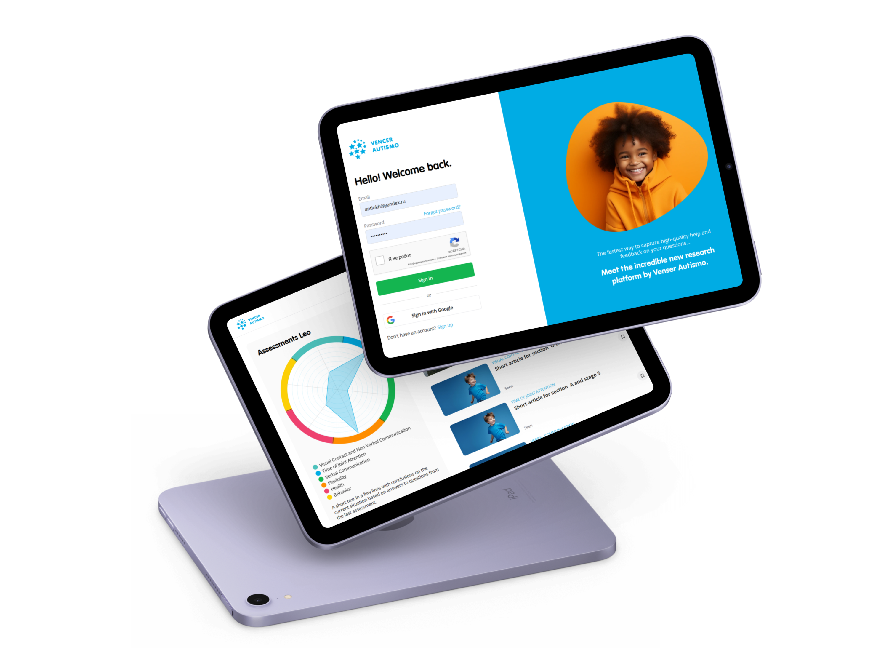

# Vencer Autismo - Assessment and Recommendation Platform

## Overview

Vencer Autismo is a web application for child assessment and parental recommendations based on recurring test results.

The product combines structured testing, weighted scoring, result normalization, visual analytics, recommendation logic, and repeat-session tracking. It is built to help parents or guardians evaluate a child's development and receive practical, personalized guidance based on the assessment output. In practice, this makes it closer to an early-stage assessment SaaS product than to a simple site with a questionnaire.

The main idea of the system is a recurring loop: complete an assessment, receive recommendations, return after two weeks, and compare progress over time.

---

## What the System Does

- Run structured multi-level assessments
- Calculate weighted scores across multiple scales
- Normalize results for more meaningful comparison
- Visualize outcomes through radar charts and history views
- Generate personalized recommendations for parents linked to content
- Store user profiles and child-related profile data
- Support repeat testing every two weeks
- Provide admin tools for managing assessment logic and content

---

## Key Features

### Structured Assessment Engine
The test system is organized as section -> subsection -> question, with each subsection containing multiple questions and weighted dual-scale answers.

---

### Low-Friction User Flow
The first session is designed to start without registration, with account creation happening after test completion in order to reduce friction and improve conversion.

---

### Longitudinal Tracking
The platform is built around repeat sessions, allowing users to return regularly and compare changes in results over time.

---

### Visual Analytics
Results are presented through radar charts, historical views, and normalized data tables, turning raw answers into interpretable insight.

---

### Personalized Recommendation System
Recommendations are mapped to score ranges and linked to content such as articles or videos, creating a structured path from child assessment to practical parental guidance.

---

### Admin-Controlled Logic
Admins can manage test structure, questions, scales, normalization logic, and recommendation behavior without rebuilding the whole product.

---

## Tech Stack

- **Frontend:** WeWeb
- **Backend:** Supabase
- **Charts / Analytics:** Chart.js
- **Data Layer:** PostgreSQL / PostgreSQL programming
- **Auth / Integrations:** OAuth, Airtable-compatible CMS workflows, email-system integration, data export
- **Skills Involved:** API integration, frontend development, UX/UI, responsive web application design

---

## Challenges

### More Than a Test Form
The product required not only questionnaire UI, but also scoring logic, normalization, recommendation mapping, user history, and protected content delivery.

---

### Friction vs Retention Balance
The onboarding flow had to stay lightweight for first-time users while still creating enough structure for long-term repeat usage.

---

### Interpretable Analytics
Assessment products need outputs that feel meaningful and understandable, which made charts, normalized values, and recommendation logic central to the system.

---

### Admin Flexibility
Because test structure and recommendation rules are part of the product itself, the admin layer had to support content and logic management rather than just basic CRUD.

---

## Result

A full-stack assessment and recommendation platform with recurring user sessions, weighted scoring, personalized content delivery, and progress tracking over time.

The product created a reusable lifecycle instead of a one-off test flow, making it suitable for retention-oriented assessment use cases and ongoing parental support.

---

## Key Takeaway

This project demonstrates the ability to build an assessment product as a real platform: structured data collection, scoring logic, analytics, content-based recommendations, repeat engagement, and admin-controlled product logic.

---

## Additional Notes

- Upwork portfolio reference: https://www.upwork.com/freelancers/antiokh?p=1767683624413745152
- Demo video: https://www.youtube.com/watch?v=z4UduwmOTRA

---

## Screenshots

### Main Product View

